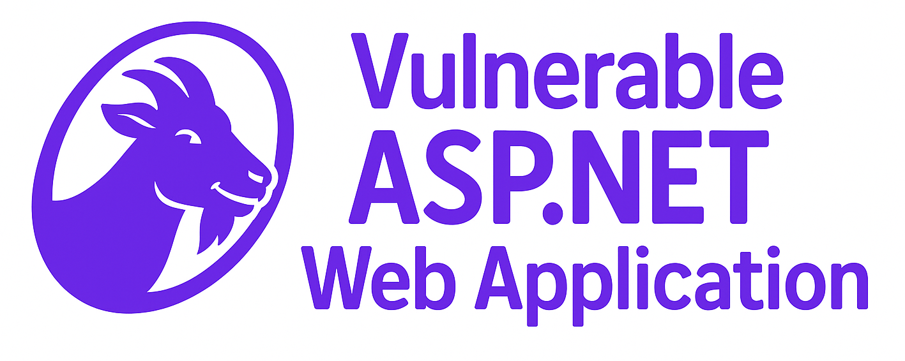

# AspGoat — A Damn Vulnerable ASP.NET Web Application

<p align="center">
  
</p>

<h2 align="center">🐐 AspGoat</h2>

<p align="center"><i>An intentionally vulnerable ASP.NET Core web application for learning and practicing Web Application Security.</i></p>

<p align="center">
  <a href="https://github.com/Soham7-dev/AspGoat/releases">
    
  </a>
  <a href="https://github.com/Soham7-dev/AspGoat/blob/main/LICENSE">
    
  </a>
  <a href="https://github.com/Soham7-dev/AspGoat/stargazers">
    
  </a>
  <a href="https://github.com/Soham7-dev/AspGoat/network/members">
    
  </a>
  <a href="https://github.com/Soham7-dev/AspGoat/actions">
    
  </a>
  <a href="https://hub.docker.com/r/sohamburger/aspgoat">
    
  </a>
</p>

---

## 📖 About AspGoat

**AspGoat** is an intentionally vulnerable **ASP.NET Core** application that helps Security Engineers and Developers analyze and mitigate common web application vulnerabilities.  
It includes the **OWASP Top 10** and beyond, providing hands-on Application Security challenges.

⚠️ **Disclaimer**: This project is for **educational purposes only**. Do **not** deploy to production environments.  

---

## ✨ Features

- 🐞 Intentionally vulnerable ASP.NET Core MVC app  
- 📚 Hands-on labs for:
  - **Cross-Site Scripting (XSS)**
  - **Cross-Site Request Forgery (CSRF)**
  - **SQL Injection (SQLi)**
  - **XML External Entity (XXE)**
  - **Local File Inclusion (LFI)**
  - **Remote Code Execution (RCE)**
  - **Unrestricted File Upload**
  - **Information Disclosure**
  - **Broken Authentication**
  - **Server-Side Request Forgery (SSRF)**
  - **Insecure Direct Object Reference (IDOR)**
  - **Insecure Deserialization**
  - **Command Injection**
  - **Prototype Pollution**
  - **Cache Poisoning**
  - **Server Side Template Injection (SSTI)**
  - **Secure vs Insecure coding snippets**
  - **Ready-to-run Docker setup**
- 🤖 AI / LLM Red-Teaming labs covering:
  - **Prompt Injection**
  - **Excessive Agency**
  - **Insecure Output Handling**

---

## 🕹️ Demo


---

## 🪛 Installation

### 1. Using Docker (recommended)

#### Pull the image
```bash
docker pull sohamburger/aspgoat:latest
